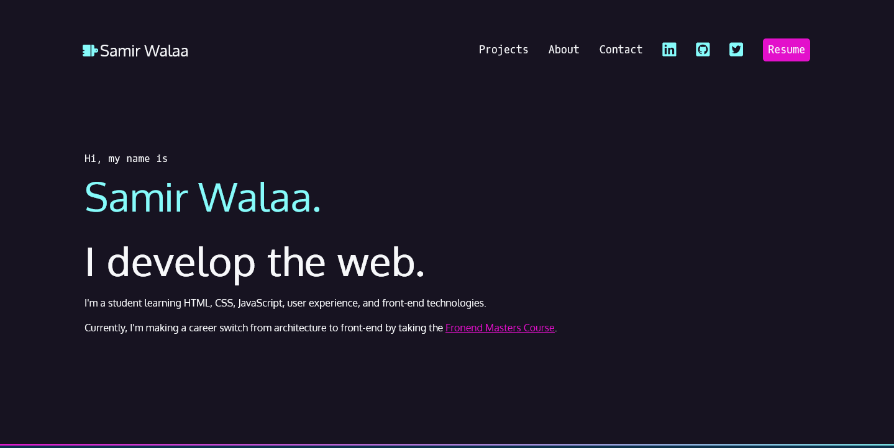
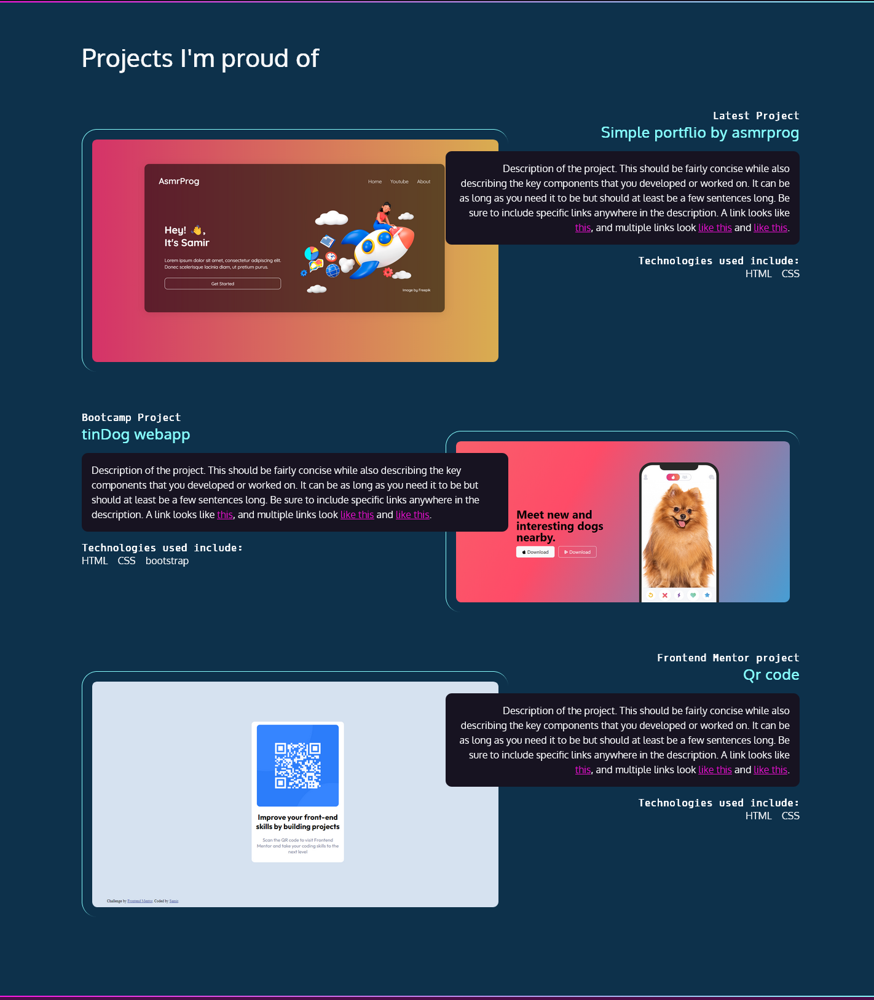
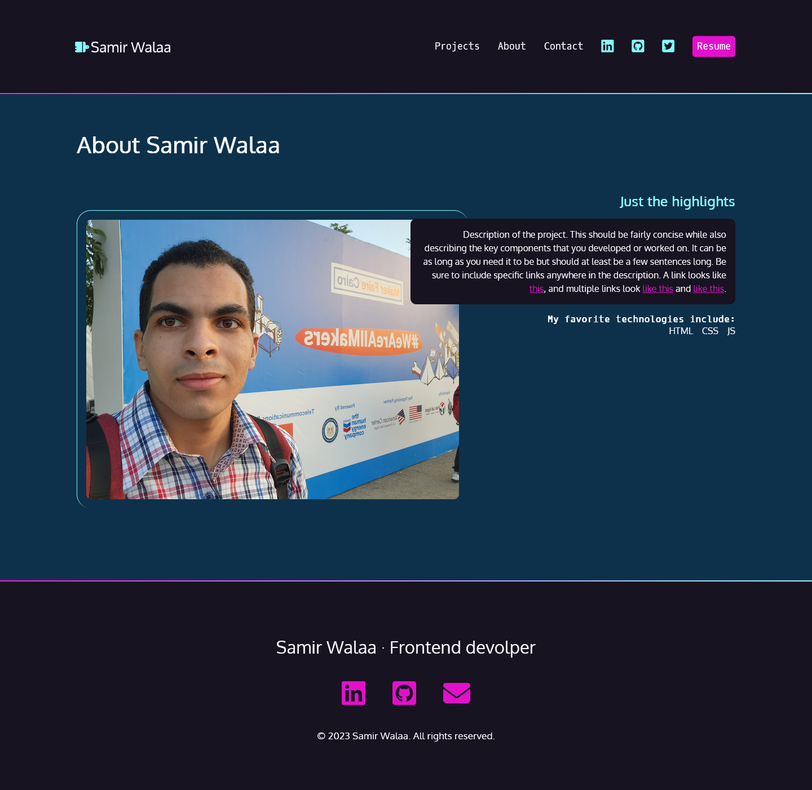

# Frontend Master - Portoflio Project

## Table of contents

- [Frontend Master - Portoflio Project](#frontend-master---portoflio-project)
  - [Table of contents](#table-of-contents)
  - [Overview](#overview)
    - [Screenshot](#screenshot)
      - [Intro section with navbar in the top](#intro-section-with-navbar-in-the-top)
      - [Project section](#project-section)
      - [Contact section](#contact-section)
      - [Footer section](#footer-section)
      - [About page](#about-page)
    - [Links](#links)
  - [My process](#my-process)
    - [Built with](#built-with)
    - [Continued development](#continued-development)
  - [Author](#author)

## Overview

A portfolio website apply to [Getting Started with CSS](https://frontendmasters.com/courses/getting-started-css/) course by Jen Kramer on [Frontend Master](https://frontendmasters.com/)

### Screenshot

#### Intro section with navbar in the top

#### Project section

#### Contact section

#### Footer section

#### About page

### Links

- Live Site URL:[Live demo](https://samirwalaa.github.io/FEMaster-portflio-project/)

## My process

### Built with

- Semantic HTML5 markup
- CSS
- Flexbox
- CSS Grid
- Mobile-first workflow

### Continued development

- Add more projects
- Expand the projects section. Rather than presenting all project information on the home page, present an overview and a link to more extensive details and links as an additional page.
- Add hamburger button to navbar
- Add dropdown to navbar
- Add a contact form to the site rather than an email button

## Author

- Website - [Samir Walaa](https://samirwalaa.github.io/FEMaster-portflio-project/)
- Twitter - [@SamirFrontend](https://twitter.com/SamirFrontend)
